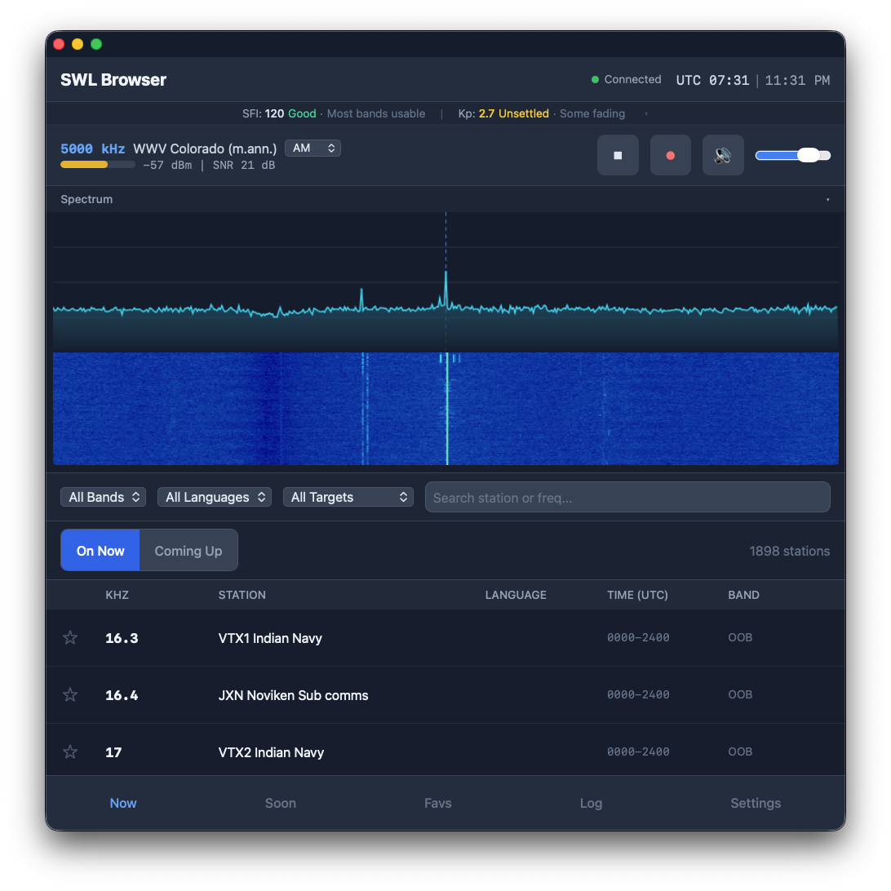
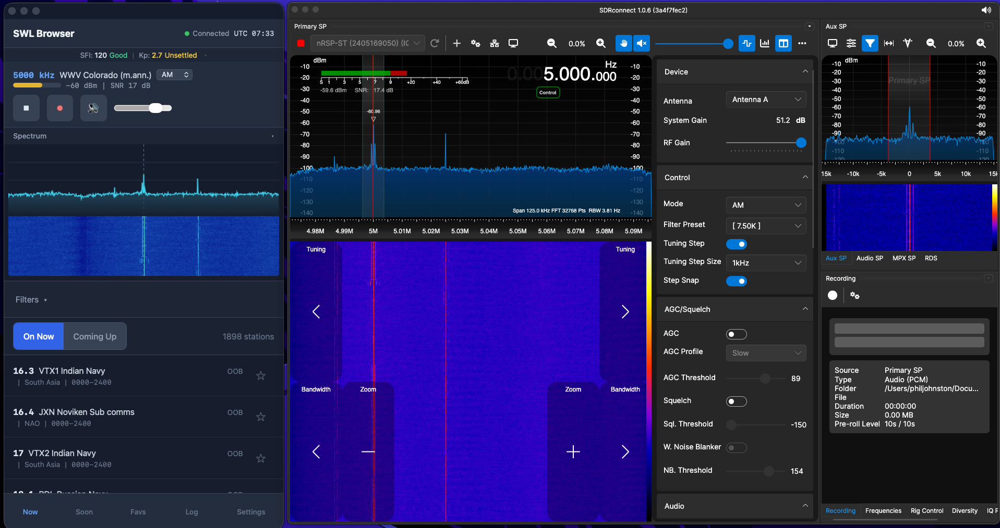

# SWL Channel Browser

Know what's on the air. Tune with one tap. Listen in your browser.

The SWL Channel Browser is a web app for shortwave listeners who use SDRplay receivers. It pairs the [EiBi schedule database](http://www.eibispace.de/) with your SDRplay hardware via [SDRconnect](https://www.sdrplay.com/sdrconnect/), so you can browse active broadcasts, tap a station, and hear it - all from your phone, tablet, or laptop.

SDRconnect already gives you a capable radio UI. This app adds the piece it's missing: **schedule-aware tuning.** Instead of manually scanning frequencies, you see a live list of what's broadcasting right now and tune with a single tap.





## What You Can Do

**Browse live broadcasts** - See every active shortwave broadcast at the current UTC time, pulled from the EiBi database (~10,000 stations). Filter by band, language, or target region. Search by station name or frequency. Switch between "On Now" and "Coming Up" views (1, 3, or 6 hours ahead).

**Tune and listen with one tap** - Tap any station to tune your SDRplay receiver and start listening in your browser. The app automatically selects the right demodulation mode (AM, SAM, USB, LSB, CW, NFM, WFM) and bandwidth for each station.

**Stream audio to any device** - Listen through your phone, tablet, or laptop over WiFi. 48kHz audio streaming with volume control, mute, and in-browser recording (WebM/Opus with WAV export).

**See signal conditions** - Live signal power (dBm) and SNR (dB) meter updates in real time. Real-time spectrum display and scrolling waterfall spectrogram. Solar flux and geomagnetic data from NOAA with per-band condition badges (Good/Fair/Poor).

**Tune any frequency** - Enter any frequency manually to tune your receiver to stations not in the EiBi database. Supports kHz and MHz input with automatic demod mode and bandwidth selection.

**Curated station lists** - Organize saved stations into named lists (DX targets, utility stations, favorites, etc.). Create, rename, and delete lists. Export and import lists as JSON for backup or sharing. Save any tuned station to a list with custom notes via the bookmark button in the now-playing bar.

**Reception log** - Log receptions with auto-captured signal metrics and personal notes. Export your log as CSV.

**Use it like a native app** - Installable as a PWA on iPhone, iPad, Android, or desktop. Dark theme optimized for listening sessions. Responsive layout with safe area support for notched iPhones.

## Requirements

- Any [SDRplay receiver](https://www.sdrplay.com/) (RSP1B, RSPdx-R2, RSPduo, nRSP-ST, or discontinued models)
- [SDRconnect](https://www.sdrplay.com/sdrconnect/) v1.0.6+ running on the same network
- Node.js 18+
- A browser on the same LAN as SDRconnect (phone, tablet, or computer)

## Quick Start

```bash
git clone https://github.com/eusef/swl-channel-browser.git
cd swl-channel-browser
npm install
```

Create a `.env` file:

```
PORT=3000
SDRCONNECT_HOST=127.0.0.1
SDRCONNECT_PORT=5454
```

Run in development mode:

```bash
npm run dev
```

Open `http://localhost:5173` on any device on your network.

For production, build and start the server instead:

```bash
npm run build
npm start
```

In production mode, open `http://localhost:3000`.

The app downloads the current EiBi schedule automatically on first launch and refreshes it weekly. No manual data setup needed.

## Mac/Linux Quick Install

If you don't have Git and Node.js installed, the install script handles everything:

```bash
bash install.sh
```

Uses Homebrew on Mac, apt/dnf on Linux. If Git and Node.js are already installed, it skips straight to cloning and setup.

## Windows Quick Start

Open PowerShell as Administrator and paste the contents of [`install-windows.ps1`](install-windows.ps1), or run:

```powershell
Set-ExecutionPolicy -Scope CurrentUser -ExecutionPolicy RemoteSigned -Force
powershell -File install-windows.ps1
```

This installs Git and Node.js via `winget`, clones the repo, runs `npm install`, and creates the `.env` with defaults.

On first run of `npm run dev`, Windows Firewall will prompt you to allow Node.js. Click "Allow access" so other devices on your network can connect.

## Configuration

| Setting | Default | What it does |
|---------|---------|--------------|
| `PORT` | `3000` | Server port |
| `SDRCONNECT_HOST` | `127.0.0.1` | IP or hostname of the machine running SDRconnect |
| `SDRCONNECT_PORT` | `5454` | SDRconnect WebSocket port |

Additional settings are available in the app's Settings page: default demodulation mode, antenna port selection (for multi-port receivers like RSPdx-R2 and RSPduo), time format (UTC/local), theme (dark/light), and auto-play preferences.

For nRSP-ST users: set the nRSP-ST IP in Settings to get an "Advanced Controls" link to the built-in web UI on port 9001.

## Raspberry Pi Deployment

Want an always-on listening station? A Raspberry Pi 4 can run both the backend and SDRconnect with your SDRplay receiver connected via USB. Browse and tune from any device on your network.

See [INSTALL-RASPBERRY-PI.md](INSTALL-RASPBERRY-PI.md) for the full setup guide. The short version: Pi OS Desktop 64-bit, SDRconnect in GUI mode (not `--server` mode), VNC for the display server, and xdotool to auto-connect the SDR device on boot.

## How It Works

The app connects to two services:

1. **Backend server** (port 3000) - serves the web app and schedule data from the EiBi database via REST API
2. **SDRconnect** (port 5454) - controls your SDRplay receiver via WebSocket for tuning, audio streaming, and signal data

Your browser talks directly to both. No proxy, no extra software. The backend has no SDRplay dependencies, so it can run on any machine.

## Supported Hardware

| Model | Price (USD) | Link | Notes |
|-------|-------------|------|-------|
| RSP1B | ~$155 | [sdrplay.com/rsp1b](https://www.sdrplay.com/rsp1b/) | Entry-level, 1 antenna port |
| RSPdx-R2 | ~$280 | [sdrplay.com/rspdx-r2](https://www.sdrplay.com/rspdx-r2/) | 3 antenna ports, HDR mode |
| RSPduo | ~$300 | [sdrplay.com/rspduo](https://www.sdrplay.com/rspduo/) | Dual tuner |
| nRSP-ST | ~$500 | [sdrplay.com/nrspst](https://www.sdrplay.com/nrspst/) | Networked, standalone with built-in web UI |

Discontinued models (RSP1A, RSP2, RSP2pro, RSPdx) are also supported through SDRconnect.

## Data Attribution

- Station schedules: [EiBi Short-wave Schedules](http://www.eibispace.de/) by Eike Bierwirth (free to copy and distribute)
- Propagation data: [NOAA Space Weather Prediction Center](https://www.swpc.noaa.gov/)

## License

MIT
